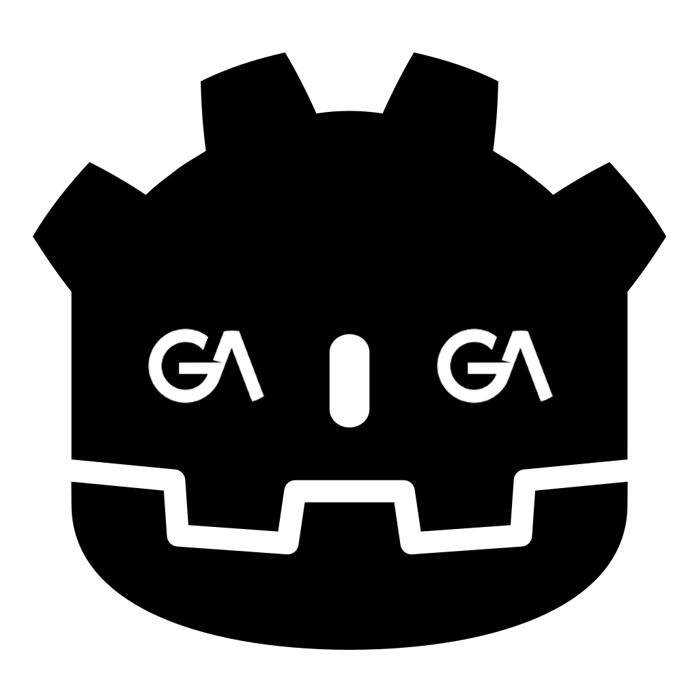

# GALite

Lightweight addon for working with [GameAnalytics](https://www.gameanalytics.com/) via REST API. 

GameAnalytics already has an [official SDK](https://github.com/GameAnalytics/GA-SDK-GODOT) for Godot, but it requires recompiling Godot engine. GALite does not require any compilation, it uses [Collection API](https://docs.gameanalytics.com/integrations/api/overview) and fully written in GDScript.

## Configuration

* Copy addons folder from this repository into your project root folder.
* Enable plugin `GAlite` under `ProjectSettings/Plugins`.
* Make sure that `GALite` exist in autoload list under `ProjectSettins/Globals/Autoload`.

## Initialization

> [!WARNING]
> Now you need generate `user_id`, `session_id`, `session_num` and `business_transaction_num` yourself, generate and save/load it from the local storage. Game Analytics expects that `session_id` has uuid format, so for generate unique ids, use uuid libraries from asset lib.

```gdscript
# Create GALiteProperties and setup these fields:
var properties := GALiteProperties.new()
properties.game_key = "5c6bcb5402204249437fb5a7a80a4959"
properties.secret_key = "16813a12f718bc5c620f56944e1abc3ea13ccbac"
properties.user_id = "test_user_0" # it's should be generated and stored in local db
properties.session_id = "de305d54-75b4-431b-adb2-eb6b9e546014" # it's should be generated
properties.session_num = 1 # it's should be stored in local db
properties.business_transaction_num = 1 # it's should be stored in local db, it's auto increment after serialize any BusinessEvent

# Initialize autoload GALite with new properties:
GALite.initialize(properties)
```

However, you can use a pre-generated template. This will allow you to quickly connect with Game Analytics and getting started, but it will make it impossible for you to differentiate users from each other in analytics dashboard.

```gdscript
var properties := GALiteProperties.make_default("[GAME_KEY]", "[GAME_SECRET]")
GALite.initialize(properties)
```

For development phase, without project in Game Analytics, you can use [sandbox](https://docs.gameanalytics.com/integrations/api/setup#sandbox).

```gdscript
var properties := GALiteProperties.make_sandbox()
GALite.initialize(properties)
```

## Workflow

Base workflow looks like:

1. Initialize GALite autoload.
2. Send init request.
3. Send user start session request at game start.
4. Send event requests during game.
5. Send user end session after game end.

For init request exist specific method:

```gdscript
await GALite.request_init_async()
```

For sending events just call `GALite.request_async()`. Request single event:

```gdscript
var progression_event := GAProgressionEvent.start("World05")
await GALite.request_async(progression_event)
```

Request group of events:

```gdscript
var progression_event := GAProgressionEvent.start("World05")
var design_event := GADesignEvent.new("GamePlay:kill:goblin")
await GALite.request_group_async([progression_event, design_event])
```

### Full Example

```gdscript
var properties := GALiteProperties.make_sandbox()
GALite.initialize(properties)

await GALite.request_init_async()
await GALite.request_async(GAUserEvent.session_start())

await GALite.request_async(GAProgressionEvent.start("World05"))

await GALite.request_async(GAUserEvent.session_end(5))
```

Other [examples](https://github.com/Scrawach/galite/tree/master/addons/galite/examples)

> [!WARNING]
> Events are sent immediately! If you want to achieve deferred sending, implement proxy with events cache and use request group from GALite API when you need it. [Example](/addons/galite/examples/queued_events_example.gd).

## Events

Game Analytics has strict requirements for the text in requests. In this regard, many events have builder methods. It's a little bit more safety, so use it.

```gdscript
# instead
var bad_start := GAProgressionEvent.new("start", "world05")

# use
var good_start := GAProgressionEvent.start("World05")
```

### User events

```gdscript
# Start session:
GAUserEvent.session_start()

# End session with 5 seconds duration
GAUserEvent.session_end(5)
```

### Progression events

```gdscript
# Start World05 level event:
GAProgressionEvent.start("World05")

# Failed World05 level with score 42
GAProgressionEvent.fail("World05").with_score(42)

# Completed World05 level with attempt numbers
GAProgressionEvent.complete("World05").with_attempt_number(3)
```

### Business events

```gdscript
# Send default business event:
GABusinessEvent.new("BlueGemsPack:CustomGem0", 50, "USD")

# Setup not required field with place, where it's purchased:
GABusinessEvent.new("BlueGemsPack:CustomGem0", 10, "USD").purchased_from("event_example")

# Setup not required filed with shop receipt:
GABusinessEvent.new("BlueGemsPack:CustomGem1", 50, "USD").with_receipt("google", "[RECEIPT]", "[SIGNATURE]")
```

### Resource events

```gdscript
# Sink item values represent what the virtual currency was spent on.
GAResourceEvent.sink("gold", "boost", "rainbowBoost", 10)

# Source item values represent in what way the virtual currency was earned.
GAResourceEvent.source("gold", "mine", "mineBoost", 15)
```

### Design events

```gdscript
# Base design event:
GADesignEvent.new("GamePlay:kill:goblin")

# Setup value with event:
GADesignEvent.new("GamePlay:kill:orc").with_value(10)
```

### Error events

```gdscript
GAErrorEvent.debug("test debug message")
GAErrorEvent.info("test info message")
GAErrorEvent.warning("test warning message")
GAErrorEvent.error("test error message")
GAErrorEvent.critical("test critical message")
```

> [!WARNING]
> Do not send more than 10 error events per game launch! [Details](https://docs.gameanalytics.com/integrations/api/event-types#error-events).

### Ads events

```gdscript
GAAdEvent.new("sdk_name", "placement", GAAdEvent.Type.VIDEO, GAAdEvent.Action.CLICKED)
GAAdEvent.new("sdk_name", "placement", GAAdEvent.Type.REWARDED_VIDEO, GAAdEvent.Action.SHOW)
```
